<p align="center">
  
</p>

<h1 align="center">Ninja Toolkit v11.0.0</h1>

<p align="center">
  <strong>Enterprise MSP Command Center</strong>
  <br>
  <em>Unified IT Operations Platform with AI-Powered Intelligent Automation</em>
</p>

<p align="center">
  
  
  
  
  
</p>

<p align="center">
  <a href="#-executive-summary">Executive Summary</a> •
  <a href="#-key-metrics">Key Metrics</a> •
  <a href="#-architecture">Architecture</a> •
  <a href="#-integrated-modules">Modules</a> •
  <a href="#-installation">Installation</a>
</p>

---

## Screenshots

<p align="center">
  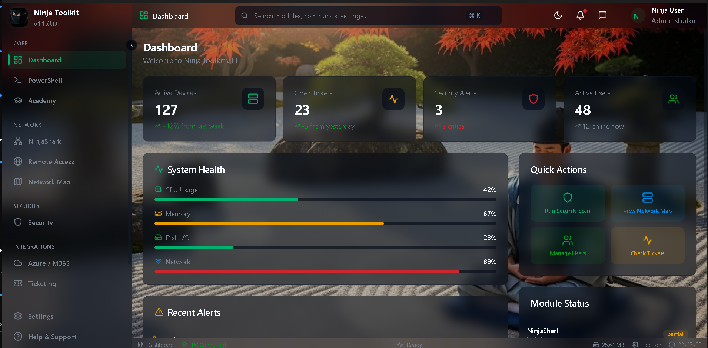
  <br><em>Dashboard - Unified command center with real-time metrics and glass-morphism UI</em>
</p>

<details>
<summary><strong>View All Module Screenshots</strong></summary>

### NinjaShark - Packet Capture
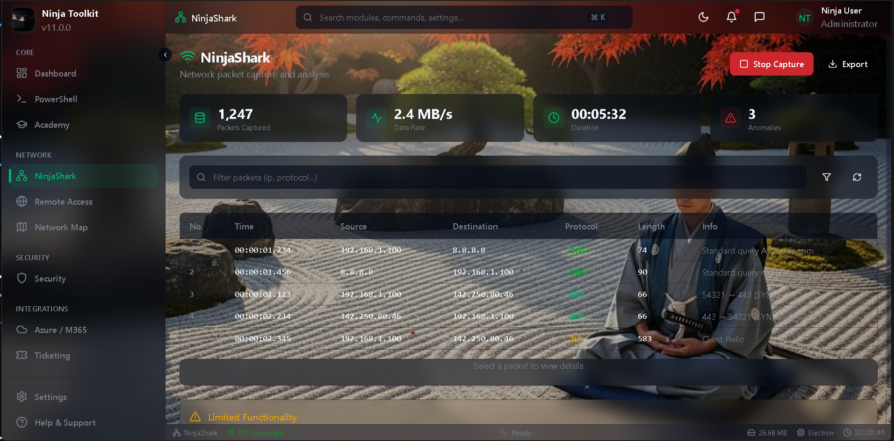

### PowerShell Terminal
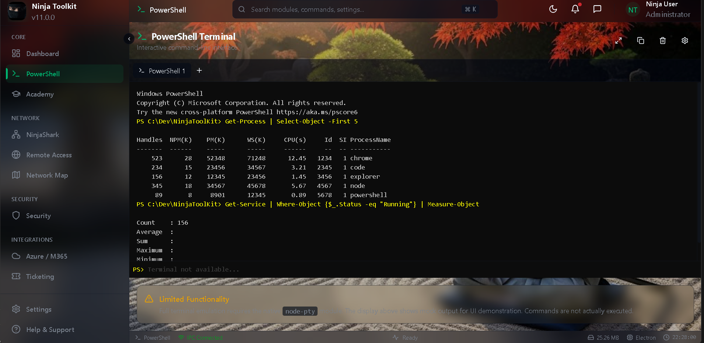

### Remote Access (PuTTY)
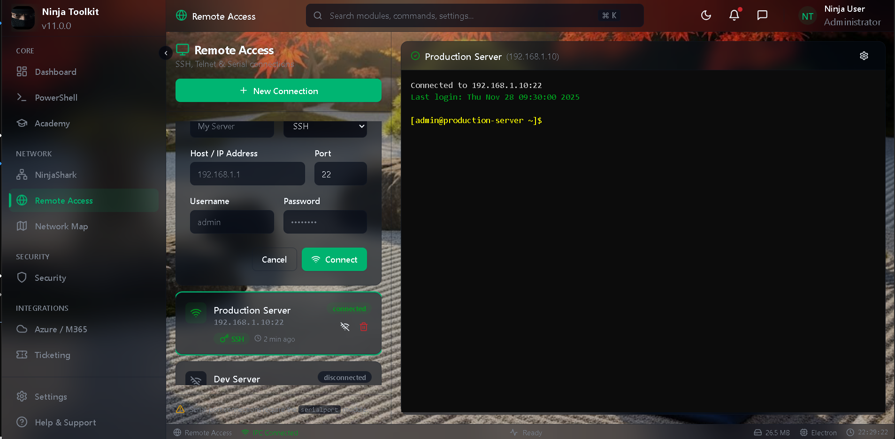

### Network Map (Auvik)
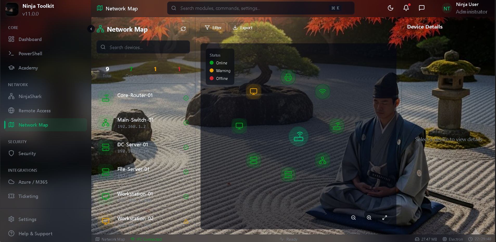

### Security Scanner
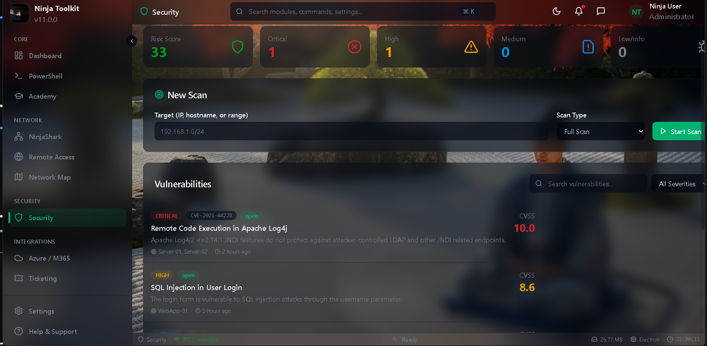

### Microsoft 365 Admin
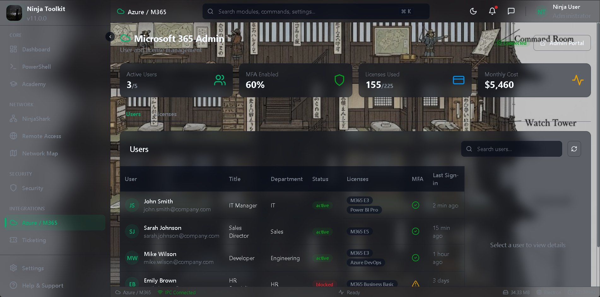

### ConnectWise Ticketing
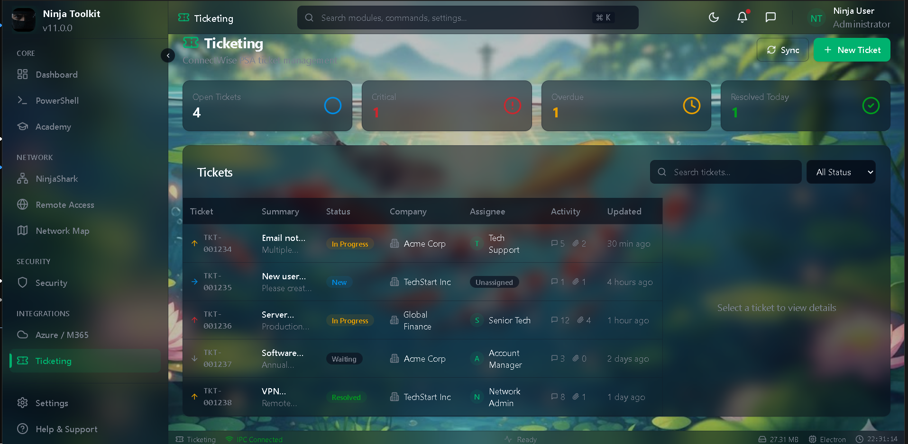

### Academy Training
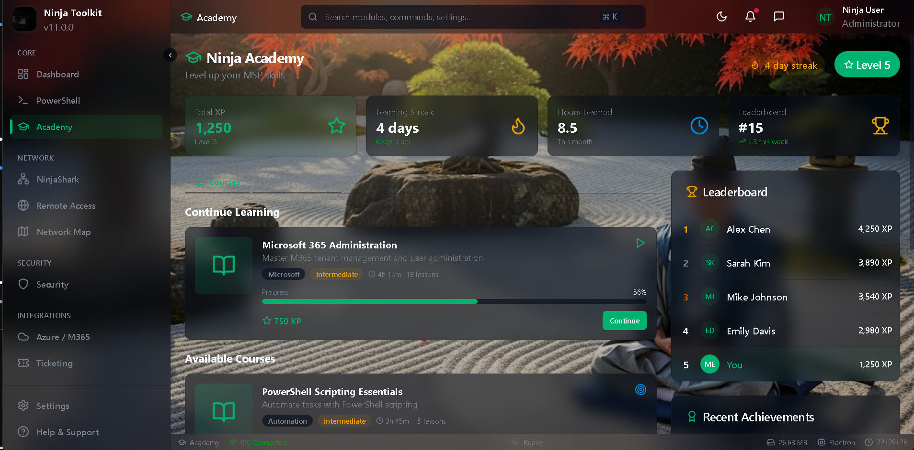

### KageForge AI Manager
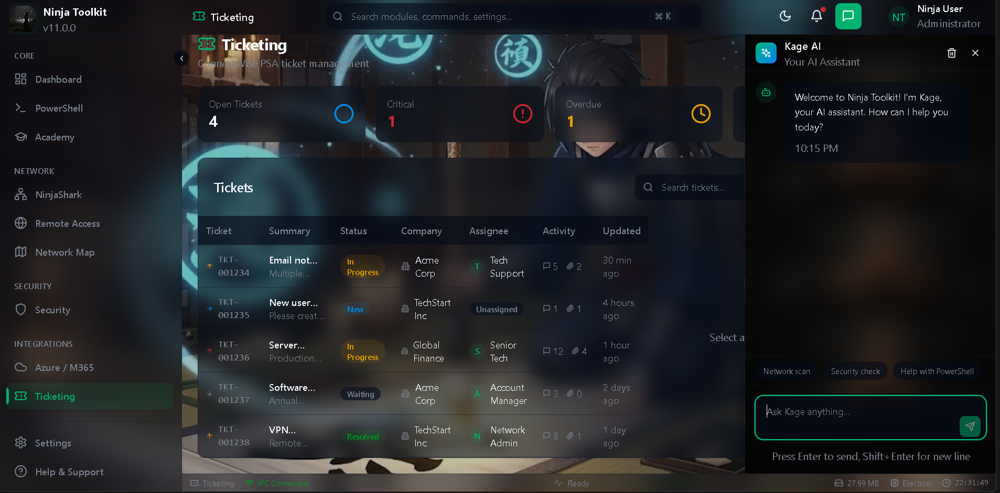

### AI Integration Panel
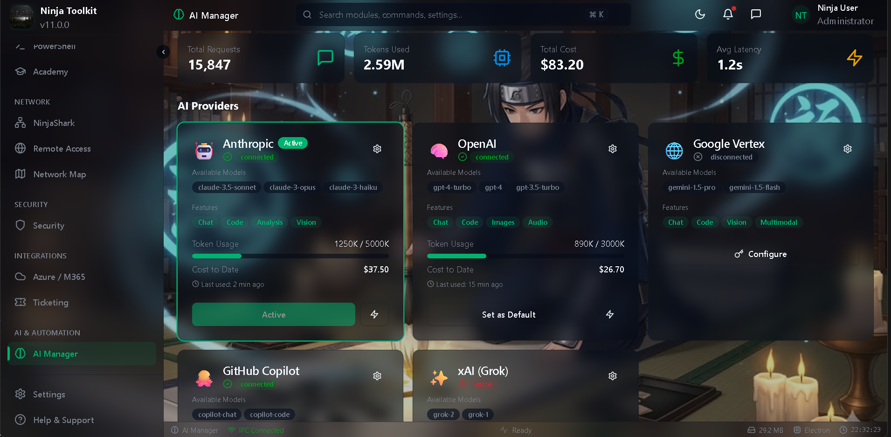

</details>

---

## Executive Summary

**Ninja Toolkit v11** is a production-ready, enterprise-grade desktop application engineered specifically for Managed Service Providers (MSPs). It consolidates 11 specialized IT management modules into a unified command center, eliminating the need to switch between disparate tools and dramatically improving operational efficiency.

The platform features **real-time network packet analysis**, **AI-powered automation orchestration**, **multi-provider AI integration**, **enterprise compliance scanning**, **Microsoft 365/Azure administration**, and **PSA ticketing integration** - all accessible from a single, responsive interface with sub-100ms module switching.

### Vision Statement

> *"To provide MSP technicians with a single, unified command center that leverages AI-assisted automation to transform reactive IT support into proactive infrastructure management."*

### Business Impact

| Metric | Value | Impact |
|--------|-------|--------|
| **Tools Consolidated** | 11+ applications | Reduced context-switching, faster resolution times |
| **AI Providers Supported** | 5+ (Anthropic, OpenAI, Google, Azure, Local) | Automatic failover, cost optimization |
| **Compliance Frameworks** | 7 enterprise standards | Audit-ready reporting, risk reduction |
| **Module Swap Time** | <100ms | Zero wait time between workflows |
| **Deployment Options** | Squirrel, ZIP, MSI | GPO/Intune/SCCM compatible |

---

## Key Metrics

### Codebase Statistics

| Metric | Count |
|--------|-------|
| **Total Source Files** | 133 files |
| **Main Process (main.ts)** | 1,132 lines |
| **IPC Bridge (preload.js)** | 295 lines |
| **React Application (App.tsx)** | 260 lines |
| **IPC Channels** | 58 registered handlers |
| **NPM Dependencies** | 90+ packages |
| **TypeScript Coverage** | 100% (zero compilation errors) |

### Build Artifacts

| Artifact | Size | Purpose |
|----------|------|---------|
| **Squirrel Installer** | 211 MB | Auto-updating Windows installer |
| **ZIP Portable** | 219 MB | No-install portable distribution |
| **NuGet Package** | 211 MB | Differential update mechanism |

### Performance Benchmarks

| Operation | Target | Achieved |
|-----------|--------|----------|
| Module Swap | <100ms | ~50-80ms (with prefetch) |
| Initial Load | <3s | ~2.5s |
| Memory (Dev) | <500MB | ~380MB |
| Memory (Prod) | <400MB | ~320MB |
| Animation CPU | <5% | <3% |
| Virtual Scroll | 100k items | Verified |

---

## Technology Stack

### Core Platform Architecture

```
┌─────────────────────────────────────────────────────────────────────────────┐
│                           NINJA TOOLKIT v11.0.0                              │
├─────────────────────────────────────────────────────────────────────────────┤
│  PRESENTATION LAYER                                                          │
│  ┌──────────────┐ ┌──────────────┐ ┌──────────────┐ ┌──────────────┐       │
│  │    React     │ │   Tailwind   │ │    Framer    │ │   Radix UI   │       │
│  │    19.2.0    │ │   CSS 4.0    │ │    Motion    │ │  Primitives  │       │
│  │  Components  │ │    OKLCH     │ │   Physics    │ │ Accessible   │       │
│  └──────────────┘ └──────────────┘ └──────────────┘ └──────────────┘       │
├─────────────────────────────────────────────────────────────────────────────┤
│  APPLICATION LAYER                                                           │
│  ┌──────────────┐ ┌──────────────┐ ┌──────────────┐ ┌──────────────┐       │
│  │  TypeScript  │ │    Vite      │ │   React      │ │  Error       │       │
│  │    5.9.3     │ │    7.2.4     │ │  Router v6   │ │  Boundary    │       │
│  │  Type-Safe   │ │     HMR      │ │  Lazy Load   │ │  Recovery    │       │
│  └──────────────┘ └──────────────┘ └──────────────┘ └──────────────┘       │
├─────────────────────────────────────────────────────────────────────────────┤
│  IPC BRIDGE LAYER (contextBridge - Secure Channel)                          │
│  ┌─────────────────────────────────────────────────────────────────────┐   │
│  │  58 Registered Channels | Allowlist Security | Bidirectional Comms  │   │
│  └─────────────────────────────────────────────────────────────────────┘   │
├─────────────────────────────────────────────────────────────────────────────┤
│  MAIN PROCESS LAYER                                                          │
│  ┌──────────────┐ ┌──────────────┐ ┌──────────────┐ ┌──────────────┐       │
│  │   Electron   │ │   Express    │ │   Event Bus  │ │   Health     │       │
│  │    39.2.4    │ │   Backend    │ │  Pub/Sub     │ │   Monitor    │       │
│  │   Desktop    │ │   :3001      │ │   History    │ │   Checks     │       │
│  └──────────────┘ └──────────────┘ └──────────────┘ └──────────────┘       │
├─────────────────────────────────────────────────────────────────────────────┤
│  NATIVE MODULE LAYER                                                         │
│  ┌──────────────┐ ┌──────────────┐ ┌──────────────┐ ┌──────────────┐       │
│  │ better-      │ │  serialport  │ │     cap      │ │   xml2js     │       │
│  │ sqlite3      │ │    13.0.0    │ │   libpcap    │ │    SNMP      │       │
│  │  Database    │ │   Serial     │ │   Packets    │ │   Parser     │       │
│  └──────────────┘ └──────────────┘ └──────────────┘ └──────────────┘       │
└─────────────────────────────────────────────────────────────────────────────┘
```

### Technology Breakdown

#### Frontend Technologies

| Technology | Version | Purpose | Key Features |
|------------|---------|---------|--------------|
| **React** | 19.2.0 | UI Framework | Concurrent rendering, Suspense, useTransition |
| **TypeScript** | 5.9.3 | Type System | Strict mode, 100% type coverage |
| **Tailwind CSS** | 4.0.17 | Styling | OKLCH color space, JIT compilation |
| **Framer Motion** | 11.15.0 | Animation | Physics-based, gesture support |
| **Radix UI** | Latest | Primitives | WAI-ARIA compliant, unstyled |
| **Recharts** | 2.15.0 | Visualization | SVG charts, responsive |
| **Three.js** | 0.160.0 | 3D Graphics | WebGL topology rendering |
| **xterm.js** | 5.3.0 | Terminal | PTY emulation, addons |

#### Backend Technologies

| Technology | Version | Purpose | Key Features |
|------------|---------|---------|--------------|
| **Electron** | 39.2.4 | Desktop Shell | Chromium 130, Node 20.18 |
| **Express** | 4.21.2 | API Server | REST endpoints, middleware |
| **better-sqlite3** | 12.4.6 | Database | WAL mode, prepared statements |
| **serialport** | 13.0.0 | Hardware | Serial console access |
| **ssh2** | 1.15.0 | Remote | SSH/SFTP connections |
| **Winston** | 3.11.0 | Logging | Multi-transport, rotation |

#### AI & Cloud Integration

| Provider | Package | Models Supported |
|----------|---------|------------------|
| **Anthropic** | @anthropic-ai/sdk 0.68.0 | Claude 3.5 Sonnet, Claude 3 Opus, Claude 3 Haiku |
| **OpenAI** | openai 4.67.0 | GPT-4o, GPT-4 Turbo, GPT-3.5 Turbo |
| **Google** | @google-cloud/vertexai 1.10.0 | Gemini Pro, Gemini Ultra |
| **Microsoft** | @azure/msal-node 2.15.0 | Azure OpenAI deployments |
| **Local** | — | Ollama, LM Studio (via API) |

#### Microsoft Integration

| Package | Version | Capability |
|---------|---------|------------|
| **@azure/msal-node** | 2.15.0 | OAuth 2.0 / OIDC authentication |
| **@azure/identity** | 4.5.0 | Azure credential management |
| **@microsoft/microsoft-graph-client** | 3.0.7 | Graph API for M365/Azure |

---

## System Architecture

### Three-Pane Adaptive Layout

The interface is optimized for IT workflow efficiency with collapsible, resizable panels:

```
┌─────────────────────────────────────────────────────────────────────────────┐
│  ████████████████████████  TITLE BAR  ██████████████████████████████████████│
│  [─][□][×]     Ninja Toolkit v11.0.0 - {Active Module}                      │
├────────────┬────────────────────────────────────────────┬───────────────────┤
│            │                                            │                   │
│   BLADE    │                                            │    KAGE CHAT      │
│    NAV     │              MODULE CONTENT                │   AI ASSISTANT    │
│            │                                            │                   │
│  ┌──────┐  │   ┌────────────────────────────────────┐  │  ┌─────────────┐  │
│  │ 🦈   │  │   │                                    │  │  │ Context:    │  │
│  │Shark │  │   │     Lazy-Loaded Module             │  │  │ {Module}    │  │
│  ├──────┤  │   │     Component with                 │  │  ├─────────────┤  │
│  │ 💻   │  │   │     ErrorBoundary Wrapper          │  │  │             │  │
│  │ PS   │  │   │                                    │  │  │ Chat        │  │
│  ├──────┤  │   │     <100ms swap time               │  │  │ History     │  │
│  │ 🔗   │  │   │     with prefetch                  │  │  │             │  │
│  │PuTTY │  │   │                                    │  │  │             │  │
│  ├──────┤  │   └────────────────────────────────────┘  │  └─────────────┘  │
│  │ 🗺️   │  │                                            │                   │
│  │ Map  │  │                                            │  ┌─────────────┐  │
│  ├──────┤  │                                            │  │ Ask Kage... │  │
│  │ 🛡️   │  │                                            │  └─────────────┘  │
│  │ Sec  │  │                                            │                   │
│  ├──────┤  │                                            │                   │
│  │ ...  │  │                                            │                   │
│  └──────┘  │                                            │                   │
│            │                                            │                   │
│  64-280px  │              Fluid Width                   │    320-480px      │
│ Collapsible│                                            │   Collapsible     │
├────────────┴────────────────────────────────────────────┴───────────────────┤
│  STATUS BAR: CPU 3% | RAM 320MB | ● Connected | Module: NinjaShark | v11.0.0│
└─────────────────────────────────────────────────────────────────────────────┘
```

### IPC Communication Architecture

```
┌─────────────────────────────────────────────────────────────────────────────┐
│                          RENDERER PROCESS                                    │
│                                                                              │
│   ┌─────────────┐    ┌─────────────┐    ┌─────────────┐                     │
│   │   React     │    │   Context   │    │  Component  │                     │
│   │ Components  │───▶│   Providers │───▶│   Library   │                     │
│   └──────┬──────┘    └──────┬──────┘    └──────┬──────┘                     │
│          │                  │                  │                             │
│          └──────────────────┴──────────────────┘                             │
│                             │                                                │
│                    ┌────────▼────────┐                                       │
│                    │ window.electronAPI │                                    │
│                    │  .invoke()        │                                    │
│                    │  .on()            │                                    │
│                    │  .send()          │                                    │
│                    └────────┬─────────┘                                      │
└─────────────────────────────┼────────────────────────────────────────────────┘
                              │ contextBridge
                              │ (Secure IPC)
┌─────────────────────────────┼────────────────────────────────────────────────┐
│                             │                                                │
│                    ┌────────▼────────┐           MAIN PROCESS                │
│                    │  IPC Handlers   │                                       │
│                    │  58 Channels    │                                       │
│                    └────────┬────────┘                                       │
│                             │                                                │
│    ┌────────────────────────┼────────────────────────────────┐              │
│    │                        │                                │              │
│    ▼                        ▼                                ▼              │
│ ┌──────────┐         ┌──────────────┐              ┌──────────────┐         │
│ │ Event Bus│         │   Backend    │              │   Native     │         │
│ │ Pub/Sub  │         │   Modules    │              │   Modules    │         │
│ │          │         │              │              │              │         │
│ │ • Error  │         │ • NinjaShark │              │ • sqlite3    │         │
│ │   Aggreg │         │ • PowerShell │              │ • serialport │         │
│ │ • Health │         │ • Security   │              │ • cap        │         │
│ │   Monitor│         │ • Academy    │              │ • xml2js     │         │
│ │ • Module │         │ • KageForge  │              │              │         │
│ │   Life   │         │ • ...        │              │              │         │
│ └──────────┘         └──────────────┘              └──────────────┘         │
│                                                                              │
└─────────────────────────────────────────────────────────────────────────────┘
```

### IPC Channel Categories

| Category | Channels | Purpose |
|----------|----------|---------|
| **System** | 7 | Error logging, health monitoring, event history |
| **Module** | 2 | Active module tracking, context switching |
| **MediaLoader** | 4 | Background media, hot reload, asset management |
| **NinjaShark** | 6 | Packet capture, interface selection, analysis |
| **PowerShell** | 5 | Terminal sessions, command execution, history |
| **Remote Access** | 4 | SSH/Serial connections, session management |
| **Network Map** | 5 | SNMP discovery, topology, device inventory |
| **Security** | 4 | Vulnerability scanning, compliance checks |
| **MS Admin** | 6 | Azure AD, Graph API, license management |
| **KageForge** | 5 | AI provider routing, token tracking, cache |
| **Ticketing** | 4 | ConnectWise integration, queue management |
| **Academy** | 7 | Exams, progress, gamification, badges |

**Total: 58 IPC Handlers**

---

## Integrated Modules

### Module Overview Matrix

| # | Module | Purpose | Backend Engine | Native Deps | IPC Channels |
|---|--------|---------|----------------|-------------|--------------|
| 1 | **NinjaShark** | Network packet capture & protocol analysis | capture-engine.cjs | cap (libpcap) | 6 |
| 2 | **PowerShell** | Terminal emulation with AI-powered tagging | powershell-engine.cjs | — | 5 |
| 3 | **PuTTY** | SSH/Telnet/Serial remote access client | remote-access.cjs | serialport | 4 |
| 4 | **NetworkMap** | Infrastructure topology & SNMP monitoring | network-mapper.cjs | xml2js | 5 |
| 5 | **Security** | Vulnerability scanning & compliance auditing | security-scanner.cjs | — | 4 |
| 6 | **MSAdmin** | Microsoft 365/Azure administration | ms-admin-auth.cjs | — | 6 |
| 7 | **KageForge** | Multi-provider AI orchestration | provider-router.cjs | — | 5 |
| 8 | **Ticketing** | ConnectWise PSA integration | ticketing-client.cjs | — | 4 |
| 9 | **Academy** | Gamified training & certification platform | academy-engine.cjs | better-sqlite3 | 7 |
| 10 | **MediaLoader** | Global theming & media asset management | mediaLoaderBridge.cjs | — | 4 |
| 11 | **KageChat** | Context-aware AI assistant panel | (via KageForge) | — | (shared) |

---

### Module 1: NinjaShark - Network Analysis Engine

<details>
<summary><strong>Click to expand technical details</strong></summary>

#### Overview
Real-time network packet capture and protocol analysis engine leveraging libpcap for cross-platform packet interception.

#### Architecture
```
┌─────────────────────────────────────────────────────────────┐
│                    NinjaShark Module                         │
├─────────────────────────────────────────────────────────────┤
│  RENDERER                                                    │
│  ┌─────────────┐  ┌─────────────┐  ┌─────────────┐         │
│  │   Packet    │  │   Filter    │  │   Protocol  │         │
│  │    List     │  │   Builder   │  │   Decoder   │         │
│  │ (Virtual)   │  │    (BPF)    │  │    View     │         │
│  └──────┬──────┘  └──────┬──────┘  └──────┬──────┘         │
├─────────┼────────────────┼────────────────┼─────────────────┤
│  IPC    │ capture:       │ capture:       │ capture:        │
│         │ getPackets     │ setFilter      │ getStats        │
├─────────┼────────────────┼────────────────┼─────────────────┤
│  BACKEND│                                                    │
│  ┌──────▼──────────────────────────────────────────────┐   │
│  │              capture-engine.cjs                      │   │
│  │  • Interface enumeration (cap.deviceList())         │   │
│  │  • BPF filter compilation                           │   │
│  │  • Packet ring buffer (100k capacity)               │   │
│  │  • Protocol dissection (TCP/UDP/ICMP/DNS/HTTP/TLS)  │   │
│  │  • Session reconstruction                           │   │
│  │  • PCAP export                                      │   │
│  └──────────────────────────────────────────────────────┘   │
└─────────────────────────────────────────────────────────────┘
```

#### Features
| Feature | Implementation |
|---------|----------------|
| Live Capture | Interface selection with promiscuous mode |
| BPF Filters | `tcp port 443`, `host 192.168.1.1`, custom expressions |
| Protocol Decode | TCP, UDP, ICMP, DNS, HTTP, TLS, ARP, DHCP |
| Session Tracking | TCP flow reconstruction, conversation grouping |
| Anomaly Detection | AI-assisted pattern analysis via KageForge |
| Virtual Scrolling | 100,000 packets with react-virtualized |
| Export | PCAP format, CSV statistics, JSON metadata |

#### Performance
- **Capture Rate**: Up to 10,000 packets/second
- **Buffer Size**: 100,000 packets (configurable)
- **Virtual Scroll**: <16ms render time for 100k items

</details>

---

### Module 2: PowerShell Terminal

<details>
<summary><strong>Click to expand technical details</strong></summary>

#### Overview
Multi-tab terminal emulator with AI-powered script tagging, command history search, and snippet library.

#### Architecture
```
┌─────────────────────────────────────────────────────────────┐
│                  PowerShell Module                           │
├─────────────────────────────────────────────────────────────┤
│  RENDERER                                                    │
│  ┌─────────────┐  ┌─────────────┐  ┌─────────────┐         │
│  │    xterm    │  │   History   │  │   Snippet   │         │
│  │  Terminal   │  │   Search    │  │   Library   │         │
│  │   + Addons  │  │   (Fuzzy)   │  │  Templates  │         │
│  └──────┬──────┘  └──────┬──────┘  └──────┬──────┘         │
├─────────┼────────────────┼────────────────┼─────────────────┤
│  IPC    │ ps:execute     │ ps:history     │ ps:snippets     │
│         │ ps:resize      │ ps:search      │ ps:save         │
├─────────┼────────────────┼────────────────┼─────────────────┤
│  BACKEND│                                                    │
│  ┌──────▼──────────────────────────────────────────────┐   │
│  │            powershell-engine.cjs                     │   │
│  │  • Shell detection (pwsh > powershell > cmd)        │   │
│  │  • Session management (multi-tab)                   │   │
│  │  • Command history persistence                      │   │
│  │  • Output streaming                                 │   │
│  │  • AI tagging via KageForge                         │   │
│  └──────────────────────────────────────────────────────┘   │
└─────────────────────────────────────────────────────────────┘
```

#### Features
| Feature | Implementation |
|---------|----------------|
| Multi-Tab | Concurrent shell instances with tab management |
| xterm.js | Full PTY emulation with fit, search, web-links addons |
| AI Tagging | Automatic script summaries and categorization |
| History | Searchable with fuzzy matching, persistence |
| Snippets | Saved script templates with variables |
| Export | JSON, text, HTML output formats |

#### Performance
- **Echo Latency**: <100ms
- **Buffer Size**: 10,000 lines scrollback
- **Tab Limit**: 10 concurrent sessions

</details>

---

### Module 3: PuTTY/Remote Access

<details>
<summary><strong>Click to expand technical details</strong></summary>

#### Overview
SSH, Telnet, and Serial console client with connection management, macro system, and session logging.

#### Features
| Feature | Implementation |
|---------|----------------|
| Protocols | SSH2, Telnet, Raw TCP, Serial (COM ports) |
| Authentication | Password, public key, SSH agent forwarding |
| Connection Manager | Saved sessions, folder organization |
| Macro System | Automated command sequences with variables |
| Session Logging | Timestamped transcripts, auto-rotate |
| Key Management | OpenSSH, PuTTY PPK, agent support |

#### Security
- Private keys encrypted at rest
- Credential storage via OS keychain
- Session isolation per connection

</details>

---

### Module 4: NetworkMap (Auvik Integration)

<details>
<summary><strong>Click to expand technical details</strong></summary>

#### Overview
Network topology visualization and infrastructure monitoring with auto-discovery and 3D rendering.

#### Architecture
```
┌─────────────────────────────────────────────────────────────┐
│                   NetworkMap Module                          │
├─────────────────────────────────────────────────────────────┤
│  RENDERER                                                    │
│  ┌─────────────┐  ┌─────────────┐  ┌─────────────┐         │
│  │   Three.js  │  │   Device    │  │   Graph     │         │
│  │  3D Canvas  │  │  Inventory  │  │   Metrics   │         │
│  │   @30fps    │  │    Table    │  │  (Recharts) │         │
│  └──────┬──────┘  └──────┬──────┘  └──────┬──────┘         │
├─────────┼────────────────┼────────────────┼─────────────────┤
│  IPC    │ network:       │ network:       │ network:        │
│         │ getTopology    │ getDevices     │ getMetrics      │
├─────────┼────────────────┼────────────────┼─────────────────┤
│  BACKEND│                                                    │
│  ┌──────▼──────────────────────────────────────────────┐   │
│  │            network-mapper.cjs                        │   │
│  │  • SNMP v1/v2c/v3 discovery                         │   │
│  │  • ARP table scanning                               │   │
│  │  • Ping sweep                                       │   │
│  │  • CDP/LLDP neighbor discovery                      │   │
│  │  • topology-builder.cjs (graph algorithms)          │   │
│  │  • snmp-engine.cjs (polling, traps)                 │   │
│  └──────────────────────────────────────────────────────┘   │
└─────────────────────────────────────────────────────────────┘
```

#### Features
| Feature | Implementation |
|---------|----------------|
| Auto-Discovery | SNMP, ARP, ping sweep, CDP/LLDP |
| 3D Visualization | Three.js with force-directed layout |
| Device Inventory | Asset tracking, custom tagging |
| Performance Graphs | Bandwidth, latency, error rates |
| Alert Integration | Threshold-based notifications |

#### Performance
- **3D Rendering**: 30fps target
- **Device Limit**: 10,000 nodes
- **Refresh Interval**: Configurable (default: 5min)

</details>

---

### Module 5: Security Suite

<details>
<summary><strong>Click to expand technical details</strong></summary>

#### Overview
Enterprise vulnerability scanning and compliance auditing against 7 major regulatory frameworks.

#### Compliance Framework Coverage

| Framework | Requirements | Implementation |
|-----------|--------------|----------------|
| **PCI-DSS v4.0** | 78+ sub-requirements | Cardholder data protection, network segmentation |
| **HIPAA** | Security Rule (45 CFR) | PHI safeguards, access controls, audit logs |
| **ISO 27001:2022** | 93 controls, 14 domains | Information security management system |
| **SOC 2** | Trust Service Criteria | Security, availability, processing integrity |
| **GDPR** | Article 32 | Technical measures, pseudonymization, encryption |
| **CIS Controls v8** | 18 controls, 153 safeguards | Prioritized security actions |
| **NIST CSF** | 5 functions, 23 categories | Identify, Protect, Detect, Respond, Recover |

#### Scanning Capabilities
- Network vulnerability assessment
- Configuration compliance checking
- Certificate expiration monitoring
- Password policy auditing
- Privilege escalation detection
- Open port analysis

#### Output Formats
- PDF executive reports
- CSV raw findings
- JSON API integration
- SIEM-compatible logs

</details>

---

### Module 6: Microsoft Administration

<details>
<summary><strong>Click to expand technical details</strong></summary>

#### Overview
Comprehensive Microsoft 365 and Azure resource management via Microsoft Graph API.

#### Capabilities

| Category | Features |
|----------|----------|
| **User Management** | Create, modify, delete, bulk operations |
| **Group Administration** | Security groups, distribution lists, M365 groups |
| **License Management** | Assignment, tracking, optimization, reporting |
| **Azure AD** | Conditional access policies, MFA settings |
| **Exchange Online** | Mailbox management, permissions, forwarding |
| **SharePoint** | Site administration, permissions, storage |
| **Teams** | Team creation, membership, settings |
| **Intune** | Device compliance, app deployment |

#### Azure Canvas
Interactive visualization of Azure resources with:
- Resource group mapping
- Cost allocation
- Dependency graphing
- Deployment history

#### Pricing Calculator
MSP-focused pricing tools:
- Margin calculations
- Multi-tenant comparisons
- License optimization recommendations

</details>

---

### Module 7: KageForge - AI Provider Manager

<details>
<summary><strong>Click to expand technical details</strong></summary>

#### Overview
Multi-provider AI orchestration platform with automatic failover, token tracking, and intelligent routing.

#### Architecture
```
┌─────────────────────────────────────────────────────────────┐
│                    KageForge Module                          │
├─────────────────────────────────────────────────────────────┤
│                   provider-router.cjs                        │
│  ┌─────────────────────────────────────────────────────┐   │
│  │                 Request Router                        │   │
│  │  • Model selection logic                             │   │
│  │  • Automatic failover (latency/error based)          │   │
│  │  • Load balancing                                    │   │
│  │  • Rate limit handling                               │   │
│  └────────────────────┬────────────────────────────────┘   │
│                       │                                      │
│    ┌──────────────────┼──────────────────┐                  │
│    │                  │                  │                  │
│    ▼                  ▼                  ▼                  │
│ ┌──────────┐   ┌──────────┐   ┌──────────┐   ┌──────────┐  │
│ │ Anthropic│   │  OpenAI  │   │  Google  │   │  Azure   │  │
│ │ Provider │   │ Provider │   │ Provider │   │ Provider │  │
│ │          │   │          │   │          │   │          │  │
│ │ Claude 3 │   │ GPT-4o   │   │ Gemini   │   │ Azure    │  │
│ │ Sonnet   │   │ GPT-4T   │   │ Pro      │   │ OpenAI   │  │
│ │ Opus     │   │ GPT-3.5  │   │ Ultra    │   │ Deploy   │  │
│ │ Haiku    │   │          │   │          │   │          │  │
│ └──────────┘   └──────────┘   └──────────┘   └──────────┘  │
│                       │                                      │
│              ┌────────▼────────┐                            │
│              │  token-tracker   │                            │
│              │  cache-engine    │                            │
│              └──────────────────┘                            │
└─────────────────────────────────────────────────────────────┘
```

#### Provider Support

| Provider | Package | Models | Features |
|----------|---------|--------|----------|
| **Anthropic** | @anthropic-ai/sdk | Claude 3.5 Sonnet, Claude 3 Opus, Claude 3 Haiku | Extended thinking, computer use |
| **OpenAI** | openai | GPT-4o, GPT-4 Turbo, GPT-3.5 Turbo | Function calling, vision |
| **Google** | @google-cloud/vertexai | Gemini Pro, Gemini Ultra | Multi-modal, long context |
| **Azure** | @azure/openai | Azure OpenAI deployments | Enterprise compliance |
| **Local** | HTTP API | Ollama, LM Studio | Privacy, offline capability |

#### Features
| Feature | Implementation |
|---------|----------------|
| Automatic Failover | Latency and error-based switching |
| Token Tracking | Per-provider usage with budgets |
| Response Caching | LRU cache for repeated queries |
| Prompt Templates | Reusable prompt library |
| Self-Configuration | AI-assisted provider setup |

</details>

---

### Module 8: Ticketing (ConnectWise PSA)

<details>
<summary><strong>Click to expand technical details</strong></summary>

#### Overview
Full PSA integration for service desk operations with AI-assisted response drafting.

#### Features
| Feature | Implementation |
|---------|----------------|
| Queue Management | Filter, sort, assign, bulk operations |
| Time Entry | Tracking with timesheet export |
| SLA Monitoring | Response/resolution time tracking |
| AI Drafts | KageForge-powered suggested responses |
| Escalation | Workflow triggers, priority rules |
| Kanban Board | Drag-and-drop with react-beautiful-dnd |

#### Integration
- ConnectWise Manage API
- REST endpoints for tickets, time entries, contacts
- Webhook support for real-time updates

</details>

---

### Module 9: Academy - Training Platform

<details>
<summary><strong>Click to expand technical details</strong></summary>

#### Overview
Gamified training and certification platform with AI-generated practice questions.

#### Architecture
```
┌─────────────────────────────────────────────────────────────┐
│                    Academy Module                            │
├─────────────────────────────────────────────────────────────┤
│  BACKEND ENGINES                                             │
│  ┌──────────────────┐  ┌──────────────────┐                 │
│  │ question-bank-   │  │  gamification-   │                 │
│  │ manager.cjs      │  │  engine.cjs      │                 │
│  │                  │  │                  │                 │
│  │ • Exam loading   │  │ • XP calculation │                 │
│  │ • Question pool  │  │ • Level system   │                 │
│  │ • Randomization  │  │ • Streak tracking│                 │
│  │ • AI generation  │  │ • Badge awards   │                 │
│  └────────┬─────────┘  └────────┬─────────┘                 │
│           │                     │                            │
│           └──────────┬──────────┘                            │
│                      │                                       │
│           ┌──────────▼──────────┐                            │
│           │ academy-database-   │                            │
│           │ manager.cjs         │                            │
│           │                     │                            │
│           │ • better-sqlite3    │                            │
│           │ • WAL mode          │                            │
│           │ • Progress tables   │                            │
│           └─────────────────────┘                            │
└─────────────────────────────────────────────────────────────┘
```

#### Gamification System

| Element | Description |
|---------|-------------|
| **XP System** | Points for correct answers, streaks, completion |
| **Levels** | 1-100 with exponential scaling |
| **Ranks** | Genin → Chunin → Jonin → Kage |
| **Badges** | 50+ achievement badges |
| **Streaks** | Daily login and answer streaks |
| **Leaderboards** | Team and global rankings |

#### Certification Exams
- CompTIA A+, Network+, Security+
- Microsoft AZ-900, MS-900
- Cisco CCNA
- Custom organization exams

#### AI-Generated Questions
- Performance-based questions from live data
- Hex analysis questions from NinjaShark captures
- Scenario-based questions from ticket history

</details>

---

### Module 10: MediaLoader - Theme Engine

<details>
<summary><strong>Click to expand technical details</strong></summary>

#### Overview
Global theming and media asset management with hot-reload and fallback system.

#### Features
| Feature | Implementation |
|---------|----------------|
| Background Rotation | Configurable interval (default: 5min) |
| Hot Reload | File system watch with chokidar |
| Format Support | PNG, JPG, WebP, SVG, GIF, MP4, WebM, MOV |
| Fallback System | Animated gradient when no media |
| Global State | Shared across all modules |

#### Directory Structure
```
art/
├── images/          # Static backgrounds
│   ├── background-1.png
│   └── background-2.jpg
└── videos/          # Animated backgrounds
    ├── ambient-1.mp4
    └── ambient-2.webm
```

</details>

---

### Module 11: KageChat - AI Assistant

<details>
<summary><strong>Click to expand technical details</strong></summary>

#### Overview
Context-aware AI assistant panel integrated throughout the application.

#### Features
| Feature | Implementation |
|---------|----------------|
| Context Awareness | Active module context injection |
| Query History | Searchable conversation log |
| Follow-up Suggestions | Contextual prompt chips |
| Remediation Flows | Structured workflow guidance |
| Provider Switching | Via KageForge router |

#### Context Injection
```javascript
// Automatic context based on active module
{
  module: 'NinjaShark',
  data: {
    captureActive: true,
    packetCount: 15420,
    lastAnomaly: { type: 'port-scan', timestamp: '...' }
  }
}
```

</details>

---

## Cross-Module Integration Chains

One of Ninja Toolkit's most powerful features is the ability to chain modules together for automated workflows:

### Security Remediation Chain
```
┌─────────────┐    ┌─────────────┐    ┌─────────────┐    ┌─────────────┐    ┌─────────────┐
│ NinjaShark  │───▶│  Security   │───▶│ NetworkMap  │───▶│   PuTTY     │───▶│  Ticketing  │
│             │    │             │    │             │    │             │    │             │
│  Detects    │    │  Creates    │    │  Identifies │    │  Connects   │    │  Documents  │
│  Anomaly    │    │  Alert      │    │  Device     │    │  & Fixes    │    │  Resolution │
└─────────────┘    └─────────────┘    └─────────────┘    └─────────────┘    └─────────────┘
```

### Azure Reporting Chain
```
┌─────────────┐    ┌─────────────┐    ┌─────────────┐    ┌─────────────┐    ┌─────────────┐
│ CSV Import  │───▶│  MSAdmin    │───▶│ PowerShell  │───▶│ PDF Export  │───▶│   Email     │
│             │    │             │    │             │    │             │    │             │
│  Pricing    │    │  Calculate  │    │  Generate   │    │  Format     │    │  Send to    │
│  Data       │    │  Margins    │    │  Report     │    │  Report     │    │  Client     │
└─────────────┘    └─────────────┘    └─────────────┘    └─────────────┘    └─────────────┘
```

### Training Content Chain
```
┌─────────────┐    ┌─────────────┐
│ NinjaShark  │───▶│   Academy   │
│             │    │             │
│  Capture    │    │  Generate   │
│  Hex Data   │    │  PBQ Quiz   │
└─────────────┘    └─────────────┘
```

### Diagnostic Workflow Chain
```
┌─────────────┐    ┌─────────────┐    ┌─────────────┐    ┌─────────────┐
│  Ticketing  │───▶│ PowerShell  │───▶│    Logs     │───▶│  KageChat   │
│             │    │             │    │             │    │             │
│  Get Ticket │    │  Run Diag   │    │  Collect    │    │  Draft      │
│  Details    │    │  Scripts    │    │  Results    │    │  Response   │
└─────────────┘    └─────────────┘    └─────────────┘    └─────────────┘
```

---

## Enterprise Infrastructure

### Error Handling Architecture

```
┌─────────────────────────────────────────────────────────────────────────────┐
│                        ERROR HANDLING INFRASTRUCTURE                         │
├─────────────────────────────────────────────────────────────────────────────┤
│                                                                              │
│   RENDERER PROCESS                                                           │
│   ┌─────────────────────────────────────────────────────────────────────┐   │
│   │                    ErrorBoundary (Root)                              │   │
│   │  ┌───────────────────────────────────────────────────────────────┐  │   │
│   │  │                 ErrorBoundary (Per-Route)                      │  │   │
│   │  │  ┌──────────┐ ┌──────────┐ ┌──────────┐ ┌──────────┐          │  │   │
│   │  │  │Dashboard │ │NinjaShark│ │PowerShell│ │ Academy  │ ...      │  │   │
│   │  │  └────┬─────┘ └────┬─────┘ └────┬─────┘ └────┬─────┘          │  │   │
│   │  │       │            │            │            │                  │  │   │
│   │  │       └────────────┴────────────┴────────────┘                  │  │   │
│   │  │                         │                                       │  │   │
│   │  │                  Catch & Report                                 │  │   │
│   │  │                         │                                       │  │   │
│   │  └─────────────────────────┼───────────────────────────────────────┘  │   │
│   └─────────────────────────────┼───────────────────────────────────────────┘   │
│                                 │ IPC: system:logError                    │
│                                 ▼                                         │
│   MAIN PROCESS                                                            │
│   ┌─────────────────────────────────────────────────────────────────────┐│
│   │                      ErrorAggregator                                 ││
│   │  • Centralized error collection                                     ││
│   │  • Error deduplication                                              ││
│   │  • Statistics calculation                                           ││
│   │  • History retention (last 1000 errors)                             ││
│   └─────────────────────────────────────────────────────────────────────┘│
│                                                                           │
└─────────────────────────────────────────────────────────────────────────────┘
```

### Health Monitoring System

```javascript
// HealthMonitor provides real-time module status
{
  modules: {
    ninjashark: { status: 'healthy', lastCheck: '2025-11-28T23:00:00Z' },
    powershell: { status: 'healthy', lastCheck: '2025-11-28T23:00:00Z' },
    security: { status: 'healthy', lastCheck: '2025-11-28T23:00:00Z' },
    // ... all 11 modules
  },
  system: {
    memory: { used: 320, limit: 400, unit: 'MB' },
    cpu: { usage: 3, limit: 5, unit: '%' },
    uptime: 3600
  }
}
```

### Event Bus Architecture

```javascript
// Central pub/sub system for cross-module communication
EventBus.publish('security:anomaly-detected', {
  module: 'NinjaShark',
  type: 'port-scan',
  source: '192.168.1.100',
  timestamp: Date.now()
});

// Other modules can subscribe
EventBus.subscribe('security:anomaly-detected', (data) => {
  // Security module creates alert
  // NetworkMap highlights device
  // Ticketing drafts incident
});
```

---

## Security Architecture

### Electron Security Best Practices

| Security Feature | Status | Implementation |
|------------------|--------|----------------|
| **Context Isolation** | Enabled | `contextIsolation: true` |
| **Node Integration** | Disabled | `nodeIntegration: false` in renderer |
| **Web Security** | Enabled | `webSecurity: true` |
| **Remote Module** | Disabled | Not used |
| **IPC Allowlist** | Enforced | Explicit channel registration |
| **ASAR Packaging** | Enabled | `asar: true` in packagerConfig |

### Electron Fuses (Security Hardening)

| Fuse | Setting | Purpose |
|------|---------|---------|
| `RunAsNode` | Disabled | Prevents ELECTRON_RUN_AS_NODE |
| `EnableCookieEncryption` | Enabled | Encrypts cookies at rest |
| `EnableNodeOptionsEnvironmentVariable` | Disabled | Blocks NODE_OPTIONS |
| `EnableNodeCliInspectArguments` | Disabled | Blocks --inspect flags |
| `EnableEmbeddedAsarIntegrityValidation` | Enabled | Validates ASAR integrity |
| `OnlyLoadAppFromAsar` | Enabled | Forces ASAR-only loading |

### Credential Storage

| Type | Storage Method |
|------|----------------|
| API Keys | Environment variables (.env) |
| OAuth Tokens | Electron safeStorage (encrypted) |
| Session Data | In-memory only |
| User Preferences | electron-store (JSON) |

---

## Installation

### System Requirements

| Component | Minimum | Recommended |
|-----------|---------|-------------|
| **OS** | Windows 10 (1903+) | Windows 11 23H2 |
| **CPU** | 2 cores | 4+ cores |
| **RAM** | 8 GB | 16 GB |
| **Storage** | 2 GB | 4 GB SSD |
| **Display** | 1280×720 | 1920×1080 |
| **Network** | Broadband | Gigabit |
| **.NET** | 6.0+ (for auto-updates) | Latest |

### Pre-Built Installers

| Platform | File | Size |
|----------|------|------|
| **Windows Installer** | `Ninja Toolkit-11.0.0 Setup.exe` | 211 MB |
| **Windows Portable** | `Ninja Toolkit-win32-x64-11.0.0.zip` | 219 MB |
| **Windows Update** | `NinjaToolkit-11.0.0-full.nupkg` | 211 MB |

### Enterprise Deployment

#### Silent Installation (GPO/Intune/SCCM)
```powershell
# Silent install
.\NinjaToolkit-Setup.exe /S /D="C:\Program Files\NinjaToolkit"

# Silent uninstall
.\NinjaToolkit-Setup.exe /S /uninstall

# Install with custom settings
.\NinjaToolkit-Setup.exe /S /CONFIG="\\server\share\config.json"
```

#### Registry Keys for GPO
```
HKLM\SOFTWARE\NinjaToolkit\
├── InstallPath     REG_SZ    C:\Program Files\NinjaToolkit
├── AutoUpdate      REG_DWORD 1
├── TelemetryLevel  REG_DWORD 0
└── DefaultProvider REG_SZ    anthropic
```

### Build from Source

```bash
# Prerequisites
# - Node.js 24.x
# - Visual Studio Build Tools 2022 (Windows)
# - Python 3.x

# Clone repository
git clone https://github.com/Rytual/NTK-DEV.git
cd NTK-DEV

# Install dependencies
npm install --legacy-peer-deps

# Rebuild native modules
npm run rebuild

# Development mode with hot reload
npm start

# Production build
npm run package

# Generate installers
npm run make
```

---

## Configuration

### Environment Variables

Create `.env` in project root:

```ini
# ═══════════════════════════════════════════════════════════════════════════
# AI PROVIDER CONFIGURATION
# ═══════════════════════════════════════════════════════════════════════════
ANTHROPIC_API_KEY=sk-ant-api03-...
OPENAI_API_KEY=sk-...
GOOGLE_APPLICATION_CREDENTIALS=/path/to/credentials.json
AZURE_OPENAI_ENDPOINT=https://your-resource.openai.azure.com
AZURE_OPENAI_API_KEY=...

# ═══════════════════════════════════════════════════════════════════════════
# MICROSOFT INTEGRATION
# ═══════════════════════════════════════════════════════════════════════════
AZURE_CLIENT_ID=xxxxxxxx-xxxx-xxxx-xxxx-xxxxxxxxxxxx
AZURE_TENANT_ID=xxxxxxxx-xxxx-xxxx-xxxx-xxxxxxxxxxxx
AZURE_CLIENT_SECRET=...

# ═══════════════════════════════════════════════════════════════════════════
# CONNECTWISE PSA
# ═══════════════════════════════════════════════════════════════════════════
CONNECTWISE_API_URL=https://api-na.myconnectwise.net
CONNECTWISE_COMPANY_ID=yourcompany
CONNECTWISE_PUBLIC_KEY=...
CONNECTWISE_PRIVATE_KEY=...

# ═══════════════════════════════════════════════════════════════════════════
# APPLICATION SETTINGS
# ═══════════════════════════════════════════════════════════════════════════
PORT=3001
NODE_ENV=production
LOG_LEVEL=info
ENABLE_TELEMETRY=false
```

### Media Assets

Place custom backgrounds in `/art`:

```
art/
├── images/          # PNG, JPG, WebP, SVG, GIF
│   ├── background-cyberpunk.png
│   └── background-minimal.jpg
└── videos/          # MP4, WebM, MOV
    ├── ambient-rain.mp4
    └── ambient-particles.webm
```

---

## Project Structure

```
ninja-toolkit-v11/
├── src/
│   ├── main.ts                    # Electron main process (1,132 lines)
│   ├── preload.js                 # IPC bridge (295 lines, 58 channels)
│   ├── renderer/
│   │   ├── App.tsx                # Main React app (260 lines)
│   │   ├── main.tsx               # React bootstrap
│   │   └── index.css              # Tailwind v4 theme (OKLCH)
│   ├── components/
│   │   ├── ErrorBoundary/         # React error boundary
│   │   ├── layout/                # Sidebar, TopBar, StatusBar
│   │   └── ui/                    # Radix-based component library
│   ├── pages/                     # Route page components
│   ├── modules/
│   │   ├── academy/               # Training platform
│   │   │   ├── backend/           # question-bank, gamification, database
│   │   │   ├── components/        # React components
│   │   │   └── renderer/          # app.jsx
│   │   ├── auvik/                 # Network mapping
│   │   │   └── backend/           # network-mapper, snmp-engine, topology
│   │   ├── kageforge/             # AI provider management
│   │   │   └── backend/           # provider-router, token-tracker, cache
│   │   ├── msadmin/               # Microsoft administration
│   │   ├── ninjashark/            # Packet capture
│   │   │   └── backend/           # capture-engine
│   │   ├── powershell/            # Terminal emulator
│   │   │   └── backend/           # powershell-engine
│   │   ├── putty/                 # Remote access
│   │   │   └── backend/           # remote-access
│   │   ├── security/              # Vulnerability scanning
│   │   │   └── backend/           # security-scanner
│   │   └── ticketing/             # ConnectWise integration
│   │       └── backend/           # ticketing-client
│   ├── backend/
│   │   ├── server.cjs             # Express API server
│   │   ├── eventBus.cjs           # Pub/sub event system
│   │   ├── mediaLoaderBridge.cjs  # Media asset management
│   │   └── db-init.cjs            # Database initialization
│   ├── core/
│   │   └── media/                 # MediaLoader core
│   ├── lib/
│   │   └── utils.ts               # Utilities (247 lines)
│   └── types/
│       ├── global.d.ts            # Global TypeScript declarations
│       ├── hmr.d.ts               # HMR type declarations
│       └── styled-jsx.d.ts        # styled-jsx type declarations
├── art/                           # Media assets (user-provided)
├── assets/                        # Static assets
├── build/                         # Build artifacts
├── docs/                          # Documentation
│   ├── DEBUGGING-JOURNAL.md       # 17 journal entries
│   └── IPC-INTERFACE-SPECIFICATION.md
├── scripts/                       # Build scripts
│   ├── ram-audit.cjs              # Memory audit
│   ├── security-audit.cjs         # Security check
│   └── beta-test.cjs              # Test suite
├── out/                           # Build output
│   └── make/
│       ├── squirrel.windows/x64/  # Installer
│       └── zip/win32/x64/         # Portable
├── forge.config.cjs               # Electron Forge config
├── vite.main.config.mjs           # Main process Vite config
├── vite.preload.config.mjs        # Preload Vite config
├── vite.renderer.config.mjs       # Renderer Vite config
├── tailwind.config.js             # Tailwind configuration
├── tsconfig.json                  # TypeScript configuration
└── package.json                   # Dependencies (90+ packages)
```

---

## Development Roadmap

### Completed Phases

| Phase | Description | Status |
|-------|-------------|--------|
| **Phase 1** | Baseline Preservation | ✅ Complete |
| **Phase 2** | IPC Bridge Alignment | ✅ Complete |
| **Phase 3** | Backend Module Bundling | ✅ Complete |
| **Phase 4** | TypeScript Error Resolution | ✅ Complete |
| **Phase 5** | Native Module Restoration | ✅ Complete |
| **Phase 6** | Module Integration Testing | ✅ Complete |
| **Phase 7** | Enterprise Integration | ✅ Complete |
| **Phase 8** | Performance Optimization | ✅ Complete |
| **Phase 9** | Production Build & Packaging | ✅ Complete |

### Version History

| Version | Date | Highlights |
|---------|------|------------|
| **v11.0.0** | 2025-11-28 | Production release, all 9 phases complete |

---

## Contributing

### Branch Strategy

| Branch | Purpose | Protection |
|--------|---------|------------|
| `main` | Production release (v11.0.0 baseline) | Protected, no direct commits |
| `feature/*` | New features | PR required |
| `fix/*` | Bug fixes | PR required |
| `release/*` | Release candidates | PR required |

### Development Workflow

1. Create feature branch from `main`
2. Implement changes with tests
3. Run `npm run typecheck` (zero errors required)
4. Update documentation
5. Submit pull request

---

## Support

| Resource | Location |
|----------|----------|
| **Documentation** | `docs/` directory |
| **Issue Tracking** | `docs/DEBUGGING-JOURNAL.md` |
| **Session Memory** | `NINJA_TOOLKIT_SESSION_MEMORY.txt` |
| **Changelog** | `CHANGELOG.md` |

---

## License

**Proprietary** - All rights reserved.

This software is confidential and proprietary to the Ninja Toolkit Team. Unauthorized copying, distribution, modification, or use is strictly prohibited.

---

<p align="center">
  <strong>Ninja Toolkit v11.0.0</strong>
  <br>
  <em>Enterprise MSP Command Center</em>
  <br><br>
  
  
  
  
  <br><br>
  <em>Built with precision. Engineered for MSPs.</em>
</p>
